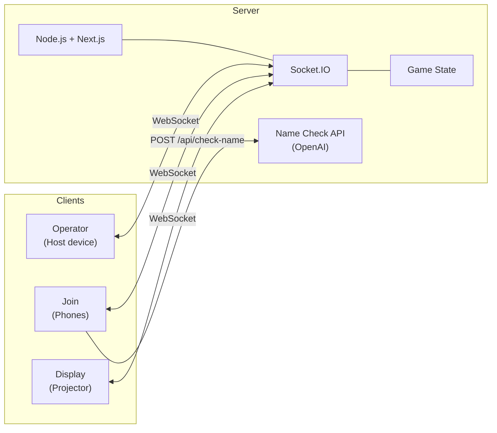
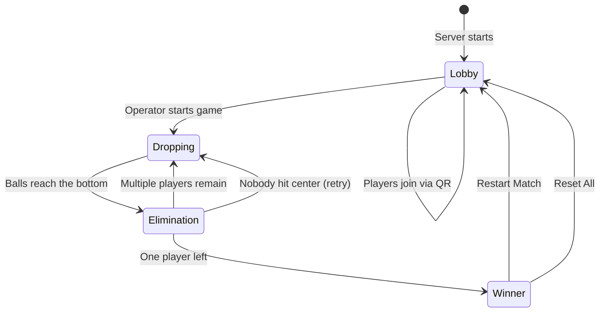

# LuckyDrop

**Turn any event into an unforgettable moment.** LuckyDrop is a real-time Plinko lucky draw that gets your whole audience on their feet. Attendees join from their phones, their emoji balls drop through a physics-powered Plinko board on the big screen, and rounds of elimination build tension until one winner remains.

No app install. No sign-up. Just scan, drop, and win.

**[Watch the demo on YouTube](https://youtu.be/HpCjDPk2bnw)**

| Lobby | Gameplay | Final Round |
|:---:|:---:|:---:|
|  |  |  |

### Why LuckyDrop?

- **Instant engagement** — Attendees scan a QR code and they're in. No downloads, no accounts.
- **Neon spectacle** — A glowing "Geometry Wars"-style board: animated grid, bloom pegs, per-player neon balls with motion trails, particle bursts, and star explosions in the win zone.
- **Cinematic moments** — Automatic slow-motion with camera push-in and screen shake for the big beats: the winning drop, the first ball into the win zone, and near-misses.
- **Real physics** — Matter.js powers the Plinko board. Every drop is different. Every round is suspenseful.
- **Dynamic audio** — Synthesized techno sound effects (peg pings, explosions, win chimes — no files required), plus TTS announcements and background music that speeds up with a tension pulse as the field narrows to the final few.
- **Pick your prizes** — Award 1 to 5 winners; the finish shows a ranked podium (gold/silver/bronze) plus runners-up.
- **Multiple boards** — *Classic*, *Cannon Crossfire*, and *Lunch Tray* levels change the obstacles and the chaos.
- **Works on any screen** — Designed for projectors and TVs at 16:9 (4K-ready). Emojis render as bundled images, so they show even on machines whose OS emoji font doesn't draw to canvas.
- **Operator control** — Run the show from your phone. Start rounds, set the winner count and level, remove players, restart matches.
- **Resilient** — The display auto-reconnects after the machine sleeps or the network blips, with a live connection indicator so you always know its status.
- **Self-hosted & free** — Run it on your own machine. No subscriptions, no vendor lock-in.

## Quick Start

```bash
git clone https://github.com/your-username/luckydrop.git
cd luckydrop
npm install
npm run dev
```

Open three browser tabs:

1. **http://localhost:3000** — Display screen (projector / shared screen)
2. **http://localhost:3000/join** — Player join page (or scan the QR code from a phone)
3. **http://localhost:3000/operator** — Your control panel

Add test players from the operator panel, hit **Start Game**, and watch the balls drop.

## How It Works

LuckyDrop has three views connected via WebSockets:

- **Display** (`/`) — The main screen shown to the audience. Shows a QR code during lobby, a physics-based Plinko board during gameplay, and celebration effects for the winner.
- **Join** (`/join`) — Mobile-friendly page where players scan the QR code and enter their name + emoji.
- **Operator** (`/operator`) — Control panel to start rounds, manage players, and run the game.

### Architecture



### Game Flow



1. Show the display screen and let players scan the QR code to join
2. The operator (optionally) picks a **level** and how many **prize winners** to award, then starts the game — all player balls drop through the Plinko board
3. The instant a ball reaches the bottom, it's decided: land in the center "WIN" zone to advance (star burst), otherwise you explode and are out
4. Rounds repeat with remaining players until a champion is crowned; the finish shows the ranked **podium** (top N winners) plus runners-up

## User Guide

### For the Event Host / Operator

#### Before the Event

1. Start LuckyDrop on a machine connected to the same network as your attendees
2. Open the **Display** (`/`) on a projector or large screen — it shows a QR code and the join URL
3. Open the **Operator** panel (`/operator`) on your phone or laptop

#### Running a Draw

1. **Lobby phase** — Attendees scan the QR code and enter their name + emoji. The display shows players as they join. Before starting, optionally pick a **level** and the number of **prize winners** (1–5). Wait until everyone is in.
2. **Start the game** — Tap "Start Game" on the operator panel. All player balls drop through the Plinko board simultaneously.
3. **Elimination** — The moment a ball hits the bottom it's decided: land in the center "WIN" zone to advance (star burst), otherwise it explodes and is out. The left sidebar shows remaining players, the right sidebar shows eliminated ones. As the field shrinks the music speeds up and a tension pulse kicks in.
4. **Subsequent rounds** — The next round starts automatically after a short pause. The win zone narrows and slow-motion kicks in for the decisive drops.
5. **Winner(s)** — When the field resolves, the display celebrates with confetti and shows the ranked **podium** — the champion (or your top N prize winners) plus runners-up.
6. **Play again** — Use "Restart Match" to go back to lobby with the same players (resets the music too), or "Reset All" to clear everything.

#### Operator Controls

| Control | What it does |
|--------|-------------|
| **Level** (lobby only) | Choose the board: Classic, Cannon Crossfire, or Lunch Tray |
| **Prize winners** (lobby only) | Set how many top places to celebrate (1–5) — the podium size at the finish |
| **Start Game** | Begins round 1 (only available in lobby with players) |
| **Restart Match** | Returns to lobby, keeps all players for another round (resets the soundtrack) |
| **Reset All** | Clears everything — players, scores, game state |
| **Remove** (per player) | Removes a specific player from the game |

#### Debug Tools

The operator panel includes debug tools for testing:

- **Add 5 / Add 40 Test Users** — Populates the game with fake players
- **Name Check toggle** — Enables/disables OpenAI name moderation (requires a funded `OPENAI_API_KEY`; off by default)

### For Players

1. Scan the QR code on the display screen (or navigate to the join URL)
2. Enter your name (1-8 characters) and pick an emoji
3. Tap "Join!" and wait for the host to start the game
4. Watch the display screen — your emoji ball drops through the Plinko board
5. If your ball lands in the center zone, you advance. Otherwise, you're eliminated.
6. Your phone shows your current status (waiting, still in, eliminated, or winner)

### Tips for a Great Draw

- **Network**: The display machine and players' phones need to be on the same WiFi network
- **Audio**: The display shows a one-time **"Tap to enable sound"** overlay — click it once at the start (browsers block autoplay until a click). After that, sound effects and music play for the whole session. Use the speaker button (bottom-right) to mute/unmute. Core sound effects are synthesized in the browser, so they work even with no audio files installed.
- **Connectivity**: A small dot (bottom-left on the display) shows connection status — green when connected, a red "Reconnecting…" pill if the socket drops. The display self-heals after the machine sleeps or the network blips; no refresh needed.
- **Sizing**: The display is designed for 16:9 screens and scales proportionally. Works best on a projector or TV.
- **Player count**: Comfortably runs 80+ concurrent players; the neon board and emoji balls are pre-baked into sprites so the frame rate holds up. Elimination narrows the field fast so rounds stay exciting.
- **Name moderation**: For public events, set a funded `OPENAI_API_KEY` and enable name checking from the operator panel to filter inappropriate names. Without it, name checking is off and all (length-valid, non-duplicate) names are accepted.

## Setup

### Prerequisites

- Node.js 18+
- npm

### Configure

```bash
cp .env.example .env.local
```

| Variable | Description | Required |
|----------|-------------|----------|
| `OPENAI_API_KEY` | OpenAI API key for name moderation | Optional |
| `PORT` | Server port (default: `3000`) | No |
| `NEXT_PUBLIC_BASE_PATH` | Base path for reverse proxy deployments | No |

Name moderation uses OpenAI to filter inappropriate player names. If no API key is set, name checking is disabled and all names are accepted.

### Sound Files

The game's **sound effects are synthesized in the browser** (Web Audio) and need no files. What *does* use files is **background music** and, optionally, richer file-based SFX — and those `.mp3`s are **not included** in this repo (licensing). Without them you still get the synth SFX + TTS announcements; you just won't have background music.

To add music/SFX files, place `.mp3` files in `public/sounds/` and edit `public/sounds/sounds.json` to map each event to your file:

```json
{
  "sfx": {
    "playerJoined": "player-joined.mp3",
    "gameStart": "game-start.mp3",
    "ballCenter": "ball-center.mp3",
    "roundComplete": "round-complete.mp3",
    "retry": "retry.mp3",
    "winnerCheers": "winner-cheers.mp3",
    "powerUp": "power-up.mp3"
  },
  "music": {
    "lobby": "lobby.mp3",
    "game": "game.mp3",
    "transition": "transition.mp3",
    "winner": "winner.mp3"
  }
}
```

Set any entry to `null` or remove it to skip that sound. Any free-to-use game sound effects and background music will work. Sites like [freesound.org](https://freesound.org) and [pixabay.com/music](https://pixabay.com/music/) have good options.

### Running in Production

```bash
npm run build
npm start
```

Or use the included control script:

```bash
./luckydrop.sh dev      # Start dev server in background
./luckydrop.sh start    # Build and start production server
./luckydrop.sh stop     # Stop the server
./luckydrop.sh status   # Check if running
./luckydrop.sh logs     # Tail the log file
```

### Remote Deployment

For deploying to a remote server via SSH and PM2, configure the `DEPLOY_*` variables in `.env.local` (see `.env.example`) and run:

```bash
./deploy.sh
```

## Hosting for Free

LuckyDrop requires a **persistent Node.js server** for WebSocket connections, so static hosts and serverless platforms (Vercel, Netlify, Cloudflare Pages) won't work. Here are free options that do:

| Platform | Free Tier | Best For | Notes |
|----------|-----------|----------|-------|
| **Your laptop** | Free | One-off events | Simplest option — just run on the same WiFi as your attendees. No internet needed. |
| [Railway](https://railway.app) | $5/month credit | Hosted events | Deploy from GitHub, supports WebSockets. Sleeps after inactivity but wakes fast. |
| [Render](https://render.com) | Free web service | Hosted events | Auto-deploys from GitHub. Free tier spins down after 15 min idle — fine for events since you spin it up beforehand. |
| [Fly.io](https://fly.io) | 3 shared VMs free | Always-on hosting | Closest to a real VPS. Needs `flyctl` CLI to deploy. Great if you want a persistent URL. |
| [Glitch](https://glitch.com) | Free | Quick demos | Import from GitHub, instant URL. Sleeps after 5 min idle but wakes on first request. |

**Recommendation:** For most people, just run it on your laptop at the event. It's the simplest setup and doesn't require internet — everyone just needs to be on the same WiFi. If you want a public URL for remote participants, Railway or Render are the easiest to set up.

## Tech Stack

- **Next.js 14** — React framework with App Router
- **Socket.IO** — Real-time WebSocket communication (with auto-reconnect)
- **Matter.js** — 2D physics engine for the Plinko board
- **Canvas 2D** — Neon board rendering, cached sprites, particle systems, and the cinematic slow-mo camera
- **Web Audio API** — Synthesized techno sound effects and dynamic music tempo/pulse
- **Twemoji** — Bundled emoji images so avatars render on any device
- **canvas-confetti** — Winner celebration
- **Tailwind CSS** — Styling
- **OpenAI API** — Optional name moderation

## License

[MIT](LICENSE)
