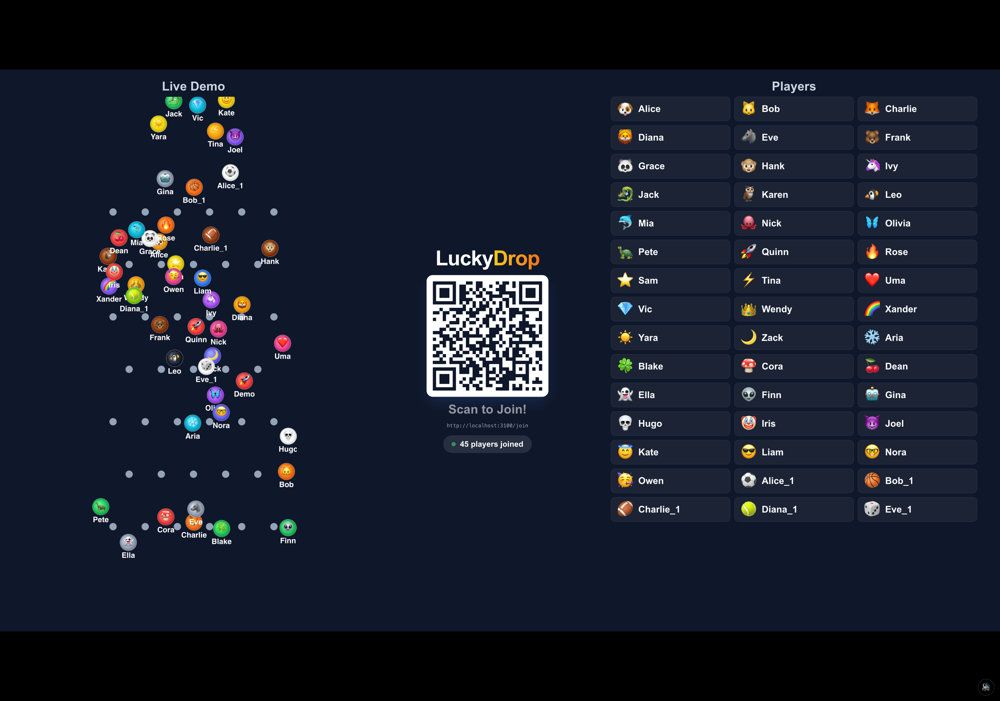
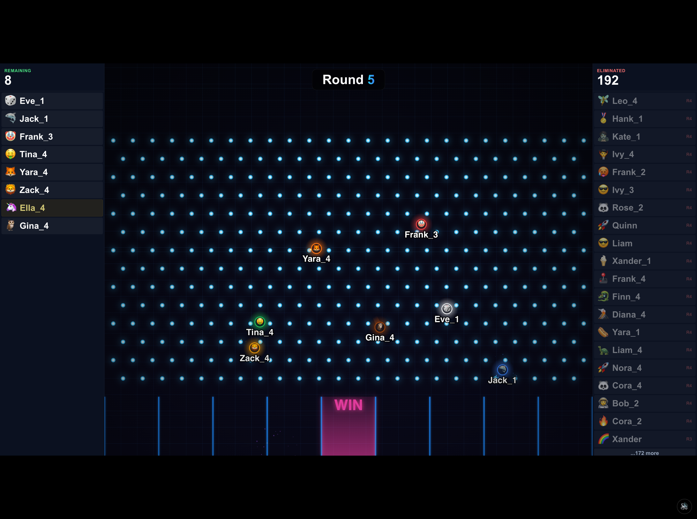
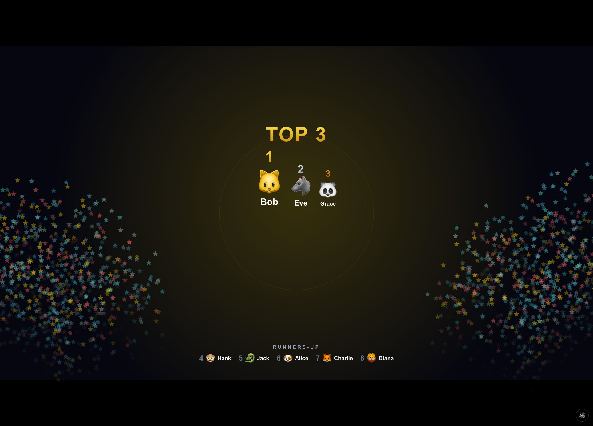
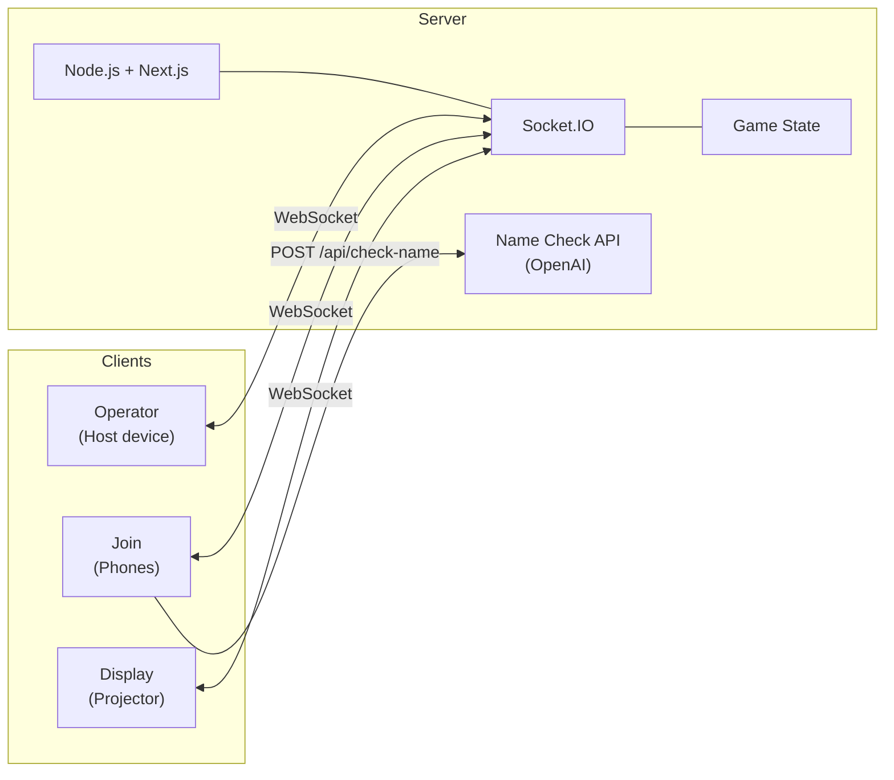
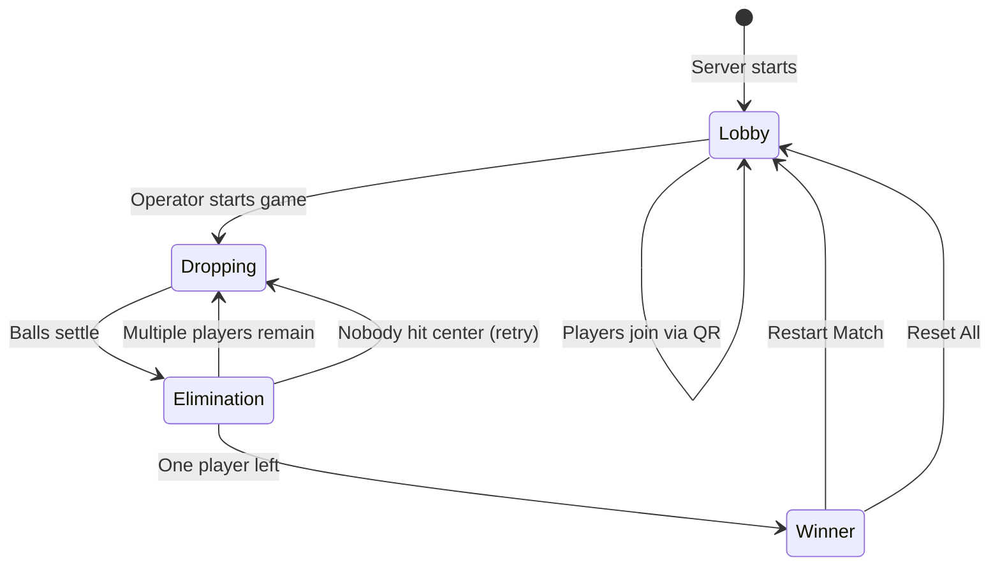

# LuckyDrop

**Turn any event into an unforgettable moment.** LuckyDrop is a real-time Plinko lucky draw that gets your whole audience on their feet. Attendees join from their phones, their emoji balls drop through a physics-powered Plinko board on the big screen, and rounds of elimination build tension until one winner remains.

No app install. No sign-up. Just scan, drop, and win.

**[Watch the demo on YouTube](https://youtu.be/HpCjDPk2bnw)**

| Lobby | Gameplay | Final Round |
|:---:|:---:|:---:|
|  |  |  |

### Why LuckyDrop?

- **Instant engagement** — Attendees scan a QR code and they're in. No downloads, no accounts.
- **Real physics** — Matter.js powers the Plinko board. Every drop is different. Every round is suspenseful.
- **Built for the big screen** — Designed for projectors and TVs at 16:9. Looks great in any venue.
- **Audio experience** — TTS announcements, sound effects, and background music keep the energy high.
- **Operator control** — Run the show from your phone. Start rounds, remove players, restart matches.
- **Battle-tested** — Used at live events with 30+ participants. It hits.
- **Self-hosted & free** — Run it on your own machine. No subscriptions, no vendor lock-in.

## Quick Start

```bash
git clone https://github.com/your-username/luckydrop.git
cd luckydrop
npm install
npm run dev
```

Open three browser tabs:

1. **http://localhost:3000** — Display screen (projector / shared screen)
2. **http://localhost:3000/join** — Player join page (or scan the QR code from a phone)
3. **http://localhost:3000/operator** — Your control panel

Add test players from the operator panel, hit **Start Game**, and watch the balls drop.

## How It Works

LuckyDrop has three views connected via WebSockets:

- **Display** (`/`) — The main screen shown to the audience. Shows a QR code during lobby, a physics-based Plinko board during gameplay, and celebration effects for the winner.
- **Join** (`/join`) — Mobile-friendly page where players scan the QR code and enter their name + emoji.
- **Operator** (`/operator`) — Control panel to start rounds, manage players, and run the game.

### Architecture



### Game Flow



1. Show the display screen and let players scan the QR code to join
2. The operator starts the game — all player balls drop through the Plinko board
3. Balls that land in the center "WIN" zone advance; others are eliminated
4. Rounds repeat with remaining players until one winner remains

## User Guide

### For the Event Host / Operator

#### Before the Event

1. Start LuckyDrop on a machine connected to the same network as your attendees
2. Open the **Display** (`/`) on a projector or large screen — it shows a QR code and the join URL
3. Open the **Operator** panel (`/operator`) on your phone or laptop

#### Running a Draw

1. **Lobby phase** — Attendees scan the QR code and enter their name + emoji. The display shows players as they join. Wait until everyone is in.
2. **Start the game** — Tap "Start Game" on the operator panel. All player balls drop through the Plinko board simultaneously.
3. **Elimination** — Balls that land in the center "WIN" zone advance to the next round. All others are eliminated. The left sidebar shows remaining players, the right sidebar shows eliminated ones.
4. **Subsequent rounds** — The next round starts automatically after a short pause. Fewer players means more tension.
5. **Winner** — When one player remains, the display shows a celebration with confetti and announces the winner.
6. **Play again** — Use "Restart Match" to go back to lobby with the same players, or "Reset All" to clear everything.

#### Operator Controls

| Button | What it does |
|--------|-------------|
| **Start Game** | Begins round 1 (only available in lobby with players) |
| **Restart Match** | Returns to lobby, keeps all players for another round |
| **Reset All** | Clears everything — players, scores, game state |
| **Remove** (per player) | Removes a specific player from the game |

#### Debug Tools

The operator panel includes debug tools for testing:

- **Add 40 Test Users** — Populates the game with fake players
- **Name Check toggle** — Enables/disables OpenAI name moderation (requires `OPENAI_API_KEY`)

### For Players

1. Scan the QR code on the display screen (or navigate to the join URL)
2. Enter your name (1-8 characters) and pick an emoji
3. Tap "Join!" and wait for the host to start the game
4. Watch the display screen — your emoji ball drops through the Plinko board
5. If your ball lands in the center zone, you advance. Otherwise, you're eliminated.
6. Your phone shows your current status (waiting, still in, eliminated, or winner)

### Tips for a Great Draw

- **Network**: The display machine and players' phones need to be on the same WiFi network
- **Audio**: Click anywhere on the display to unlock audio — the app has TTS announcements, sound effects, and background music. Use the speaker button (bottom-right) to mute/unmute.
- **Sizing**: The display is designed for 16:9 screens and scales proportionally. Works best on a projector or TV.
- **Player count**: Tested with 30+ concurrent players. Elimination narrows the field fast so rounds stay exciting.
- **Name moderation**: For public events, set an `OPENAI_API_KEY` and enable name checking from the operator panel to filter inappropriate names.

## Setup

### Prerequisites

- Node.js 18+
- npm

### Configure

```bash
cp .env.example .env.local
```

| Variable | Description | Required |
|----------|-------------|----------|
| `OPENAI_API_KEY` | OpenAI API key for name moderation | Optional |
| `PORT` | Server port (default: `3000`) | No |
| `NEXT_PUBLIC_BASE_PATH` | Base path for reverse proxy deployments | No |

Name moderation uses OpenAI to filter inappropriate player names. If no API key is set, name checking is disabled and all names are accepted.

### Sound Files

Sound files are **not included** in this repo (they aren't licensed for redistribution). The app works fine without them — you'll just get TTS announcements only.

To add sounds, place `.mp3` files in `public/sounds/` and edit `public/sounds/sounds.json` to map each event to your file:

```json
{
  "sfx": {
    "playerJoined": "player-joined.mp3",
    "gameStart": "game-start.mp3",
    "ballCenter": "ball-center.mp3",
    "roundComplete": "round-complete.mp3",
    "retry": "retry.mp3",
    "winnerCheers": "winner-cheers.mp3",
    "powerUp": "power-up.mp3"
  },
  "music": {
    "lobby": "lobby.mp3",
    "game": "game.mp3",
    "transition": "transition.mp3",
    "winner": "winner.mp3"
  }
}
```

Set any entry to `null` or remove it to skip that sound. Any free-to-use game sound effects and background music will work. Sites like [freesound.org](https://freesound.org) and [pixabay.com/music](https://pixabay.com/music/) have good options.

### Running in Production

```bash
npm run build
npm start
```

Or use the included control script:

```bash
./luckydrop.sh dev      # Start dev server in background
./luckydrop.sh start    # Build and start production server
./luckydrop.sh stop     # Stop the server
./luckydrop.sh status   # Check if running
./luckydrop.sh logs     # Tail the log file
```

### Remote Deployment

For deploying to a remote server via SSH and PM2, configure the `DEPLOY_*` variables in `.env.local` (see `.env.example`) and run:

```bash
./deploy.sh
```

## Tech Stack

- **Next.js 14** — React framework with App Router
- **Socket.IO** — Real-time WebSocket communication
- **Matter.js** — 2D physics engine for the Plinko board
- **Tailwind CSS** — Styling
- **OpenAI API** — Optional name moderation

## License

[MIT](LICENSE)
